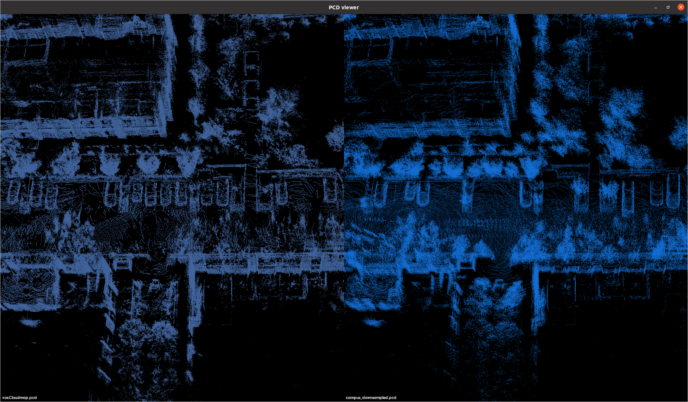
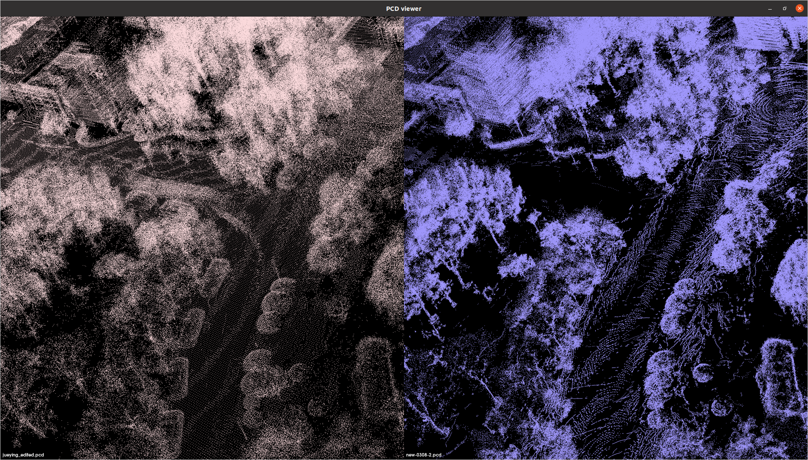

# map_update
This is a draft work, it could only run offline, and it needs a large memory space. So if the map is to big, virtual memory may be necessary.

for campus 1, right shows map before , left shows map after updating.

for campus 2 , left shows map before , right shows map after updating.

## build
catkin_make

## run
for LIOSAM dataset
roslaunch run_map_update_all.launch

